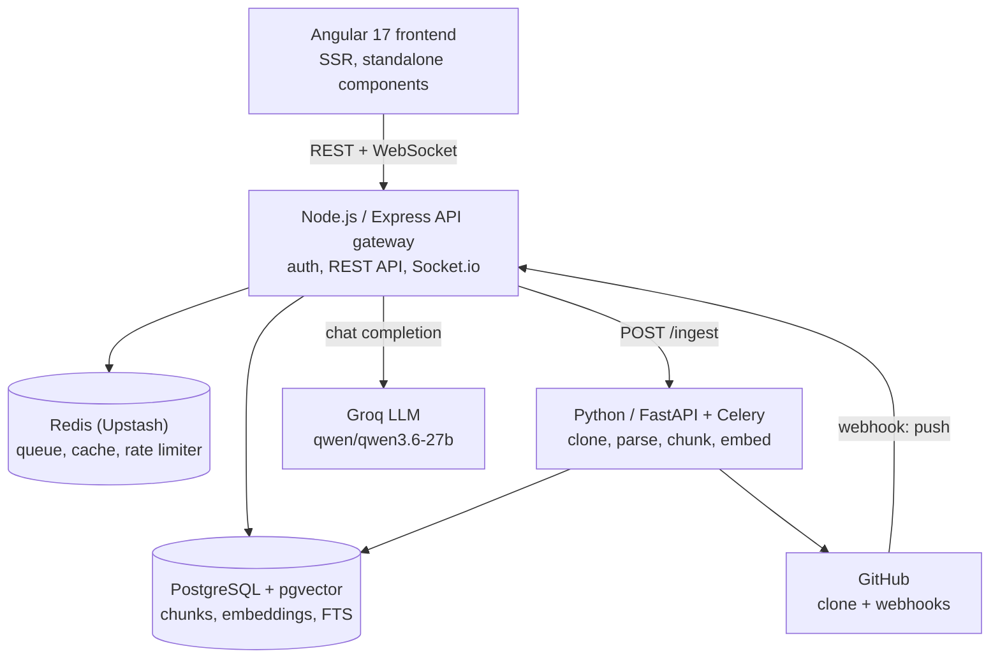

# RepoLens

AI-powered codebase intelligence. Connect a GitHub repo, ask questions in plain English, get answers grounded in the actual code with clickable file/line citations.

Repos are cloned, AST-parsed into function/class-level chunks, embedded, and indexed for hybrid (semantic + keyword) search. Questions are answered via RAG: search results are fused, trimmed to a token budget, and sent to an LLM that must return structured JSON citations.

## Architecture



1. User adds a repo → API gateway enqueues ingestion on the Python/Celery worker.
2. Worker shallow-clones, parses with Tree-sitter, chunks at function/class level, embeds with `BAAI/bge-small-en-v1.5`, writes to Postgres (embedding cache in Redis by content SHA256).
3. A question triggers vector search (pgvector) + full-text search (Postgres FTS), fused via Reciprocal Rank Fusion, trimmed with `tiktoken`, and sent to Groq for a cited JSON answer.
4. Socket.io broadcasts shared query history and file-viewing presence to everyone viewing the same repo.
5. GitHub webhooks trigger delta re-indexing of changed files only.

## Tech stack

| Layer | Technology |
|---|---|
| Frontend | Angular 17 (SSR, signals), Socket.io client |
| API Gateway | Node.js, Express 5, JWT auth, Socket.io |
| Ingestion Worker | Python, FastAPI, Celery, Tree-sitter |
| Database | PostgreSQL + pgvector (HNSW) + full-text search |
| Queue / Cache | Redis (Upstash) |
| Embeddings | `BAAI/bge-small-en-v1.5` |
| LLM | Groq (`qwen/qwen3.6-27b`) |

## Local development

No Docker — each service runs standalone against free-tier hosted Postgres/Redis.

```bash
# API gateway
cd backend/api-gateway && npm install && npm run dev        # :3000

# Ingestion worker
cd backend/ingestion && pip install -r requirements.txt
uvicorn app.main:app --reload --port 8000
celery -A app.celery_app worker --loglevel=info --pool=solo # --pool=solo on Windows

# Frontend
cd frontend && npm install && npm start                     # :4200
```

Requires a root `.env` with `DATABASE_URL`, `REDIS_URL`, `GITHUB_CLIENT_ID/SECRET`, `GITHUB_WEBHOOK_SECRET`, `JWT_SECRET`, `GROQ_API_KEY`, `WORKER_URL`, `FRONTEND_URL`.
