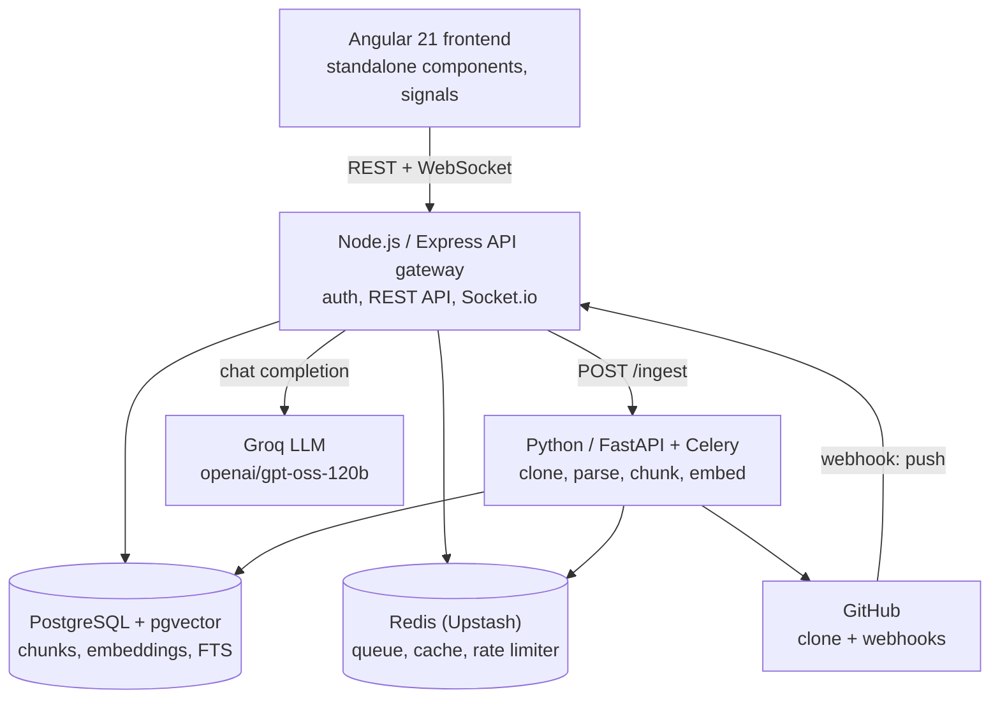

# RepoLens

**Ask questions about any GitHub codebase in plain English and get answers grounded in the real code, with clickable file and line citations.**

RepoLens clones a repository, breaks it into function- and class-level chunks, embeds them, and indexes them for hybrid (semantic + keyword) search. Questions are answered with retrieval-augmented generation (RAG): the best matching code is retrieved, fused, trimmed to a token budget, and sent to an LLM that must reply with structured, cited JSON.

## Features

- **GitHub OAuth login** with short-lived access tokens and `httpOnly` refresh cookies (Redis-backed denylist on logout)
- **Connect a repo** and watch ingestion progress, then browse the file tree and open files in a built-in code explorer
- **Hybrid search**: pgvector semantic search + Postgres full-text search, merged with Reciprocal Rank Fusion
- **Cited answers**: every answer links back to the exact files and lines it came from
- **Shared query history** and **live file-viewing presence** for everyone looking at the same repo (Socket.io)
- **Incremental re-indexing**: GitHub `push` webhooks re-index only the files that changed
- **Per-user rate limiting**: 20 queries per hour, enforced with a Redis sliding window

## Architecture


```mermaid
flowchart TB
    FE["Angular 21 frontend<br/>standalone components, signals"]
    GW["Node.js / Express API gateway<br/>auth, REST API, Socket.io"]
    PG[("PostgreSQL + pgvector<br/>chunks, embeddings, FTS")]
    RD[("Redis (Upstash)<br/>queue, cache, rate limiter")]
    IW["Python / FastAPI + Celery<br/>clone, parse, chunk, embed"]
    GH["GitHub<br/>clone + webhooks"]
    GR["Groq LLM<br/>openai/gpt-oss-120b"]

    FE -->|REST + WebSocket| GW
    GW --> PG
    GW --> RD
    GW -->|POST /ingest| IW
    GW -->|chat completion| GR
    IW --> GH
    IW --> PG
    IW --> RD
    GH -->|webhook: push| GW
```

### How it works

1. **Ingest.** Adding a repo makes the API gateway hand an ingestion job to the Python/Celery worker.
2. **Parse and chunk.** The worker shallow-clones the repo and splits files into chunks. JavaScript and TypeScript use Tree-sitter for true AST-level function/class chunks. Roughly 20 other file types (Python, Java, Go, Ruby, PHP, C/C++, Rust, HTML/CSS, JSON, YAML, Markdown, SQL, shell, Vue) use a generic line-block chunker. Tests and minified files are skipped.
3. **Embed and store.** Chunks are embedded locally with `BAAI/bge-small-en-v1.5` (384 dimensions, via `fastembed`) and written to Postgres. Embeddings are cached in Redis by content SHA-256, so unchanged code is never re-embedded.
4. **Retrieve.** A question runs a pgvector cosine search (HNSW index) and a Postgres full-text search in parallel. Results are fused with Reciprocal Rank Fusion and trimmed to a token budget using `tiktoken`.
5. **Answer.** The context goes to Groq (`openai/gpt-oss-120b`, chosen for its 65,536-token max-completion ceiling), which returns an answer with structured JSON citations.
6. **Stay fresh.** GitHub `push` webhooks trigger delta re-indexing of only the changed files.

## Tech stack

| Layer | Technology |
|---|---|
| Frontend | Angular 21 (standalone components, signals), Socket.io client |
| API gateway | Node.js, Express 5, JWT auth, Socket.io |
| Ingestion worker | Python, FastAPI, Celery, Tree-sitter, generic fallback chunker |
| Database | PostgreSQL + pgvector (HNSW) + full-text search |
| Queue / cache | Redis (Upstash) |
| Embeddings | `BAAI/bge-small-en-v1.5` via `fastembed` |
| LLM | Groq (`openai/gpt-oss-120b`) |
| Deployment | Vercel (frontend), Render (API), Docker per backend service |

## Project structure

```
RepoLens/
├── frontend/                  # Angular app (dashboard, code explorer, chat, search, history)
├── backend/
│   ├── api-gateway/           # Express API: auth, repos, query, webhooks, Socket.io
│   └── ingestion/             # FastAPI + Celery worker: clone, chunk, embed, index
├── db/migrations/             # SQL schema (users, repos, files, chunks, embeddings, queries)
├── .github/workflows/         # CI/CD for frontend and backend
└── vercel.json                # Frontend build + API/auth rewrites
```

## Getting started

Each service runs standalone against hosted (free-tier works) PostgreSQL with the `pgvector` extension and Redis.

### Prerequisites

- Node.js 20+
- Python 3.11+
- A PostgreSQL database with `pgvector` enabled
- A Redis instance
- A [GitHub OAuth app](https://github.com/settings/developers)
- A [Groq API key](https://console.groq.com)

### 1. Set up the database

Run the migrations in `db/migrations/` in order (`001_init.sql`, then `006_add_user_profile_fields.sql`).

### 2. Configure environment

Create a `.env` file in the repo root:

| Variable | Purpose |
|---|---|
| `DATABASE_URL` | PostgreSQL connection string |
| `REDIS_URL` | Redis connection string |
| `JWT_ACCESS_SECRET` | Signs short-lived access tokens |
| `JWT_REFRESH_SECRET` | Signs refresh tokens |
| `GITHUB_CLIENT_ID` | GitHub OAuth app client ID |
| `GITHUB_CLIENT_SECRET` | GitHub OAuth app client secret |
| `GITHUB_CALLBACK_URL` | OAuth callback, e.g. `http://localhost:3000/auth/github/callback` |
| `GITHUB_WEBHOOK_SECRET` | Verifies incoming GitHub webhooks |
| `GROQ_API_KEY` | LLM access |
| `WORKER_URL` | Ingestion worker URL, e.g. `http://localhost:8000` |
| `FRONTEND_URL` | Frontend origin, e.g. `http://localhost:4200` (used for CORS/redirects) |
| `PORT` | API gateway port (default `3000`) |

### 3. Run the services

```bash
# API gateway  (http://localhost:3000)
cd backend/api-gateway
npm install
npm run dev

# Ingestion worker  (http://localhost:8000)
cd backend/ingestion
pip install -r requirements.txt
uvicorn app.main:app --reload --port 8000
celery -A app.celery_app worker --loglevel=info --pool=solo   # --pool=solo is needed on Windows

# Frontend  (http://localhost:4200)
cd frontend
npm install
npm start
```

## API overview

All `/api/*` routes require authentication.

| Method | Endpoint | Description |
|---|---|---|
| `GET` | `/auth/github` | Start GitHub OAuth login |
| `GET` | `/auth/github/callback` | OAuth callback |
| `POST` | `/auth/refresh` | Refresh access token |
| `POST` | `/auth/logout` | Log out and revoke refresh token |
| `POST` | `/api/repos` | Add a repo and start ingestion |
| `GET` | `/api/repos` | List your repos |
| `GET` | `/api/repos/:id` | Get repo details and status |
| `GET` | `/api/repos/:id/files` | Get the file tree |
| `GET` | `/api/repos/:id/files/content` | Get a file's content |
| `POST` | `/api/repos/:id/reindex` | Trigger a full re-index |
| `DELETE` | `/api/repos/:id` | Delete a repo and its index |
| `GET` | `/api/repos/tasks/:taskId` | Check ingestion task status |
| `POST` | `/api/query` | Ask a question about a repo |
| `GET` | `/api/query/history` | Query history across all repos |
| `GET` | `/api/query/:repo_id/history` | Query history for one repo |
| `GET` | `/api/query/stats` | Query usage stats |
| `PUT` | `/api/users/profile` | Update your profile |
| `POST` | `/webhooks/...` | GitHub push webhook receiver |
| `GET` | `/health` | Health check |

## Deployment

- **Frontend**: built with `npm run build -- --configuration production` and deployed to Vercel on pushes to `main` that touch `frontend/`. `vercel.json` proxies `/api/*` and `/auth/*` to the hosted API.
- **Backend**: `api-gateway` and `ingestion` each ship with a Dockerfile. The ingestion image pre-downloads the embedding model at build time so cold starts stay fast, and runs Celery alongside FastAPI via `start.sh`.

## Notes

- The Angular app is built as a client-side app (static output) for Vercel; SSR support is present in the codebase but not used in production.
- No license file is included yet. Add one before accepting outside contributions.
